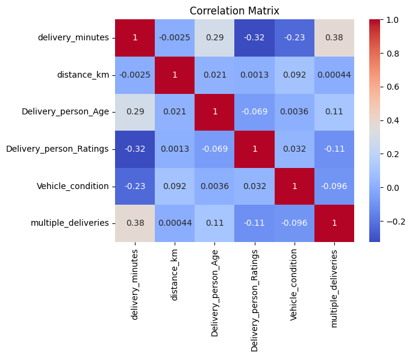
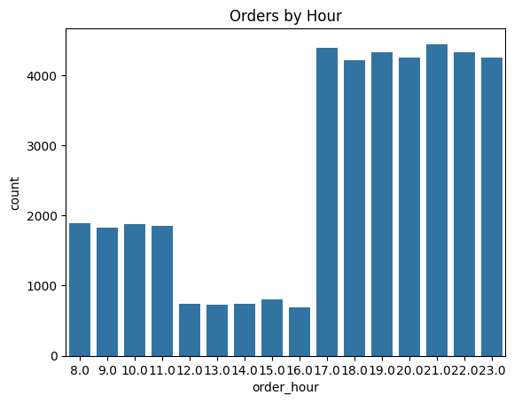
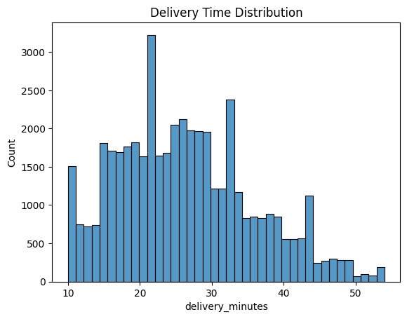
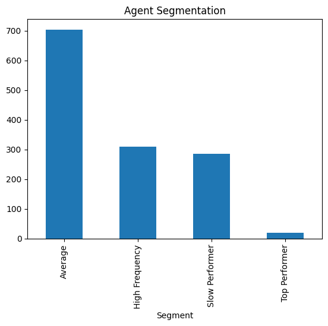
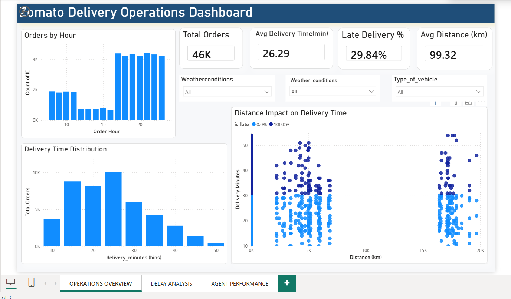
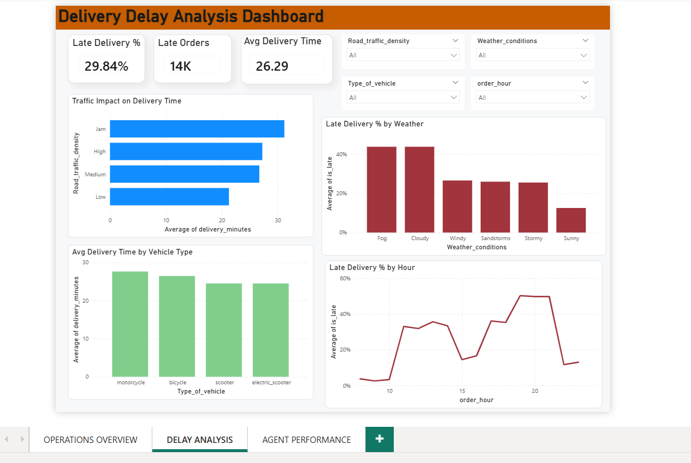
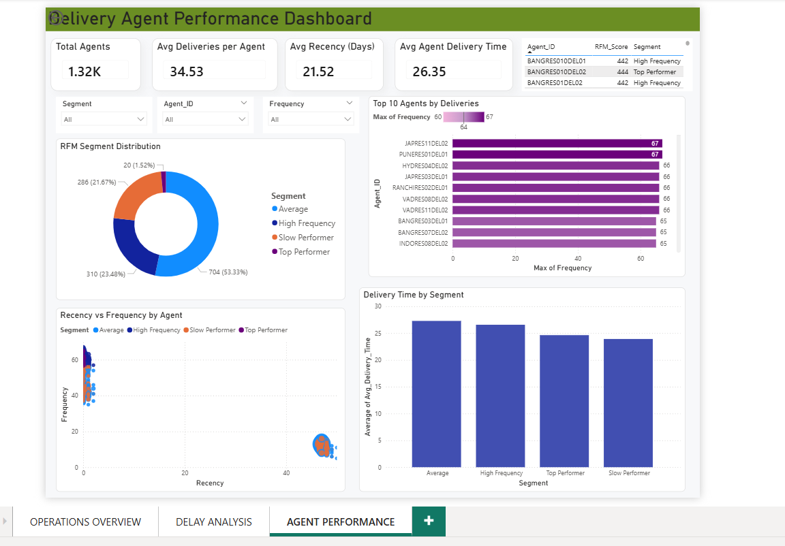

# Zomato Delivery Operations Analytics Dashboard

## Objective

Built an end-to-end data analytics project to analyze food delivery operations and identify insights related to delivery efficiency, delay causes, operational trends, and agent productivity.

The project combines Python, SQL, Machine Learning, and Power BI to convert raw delivery data into actionable business recommendations.

---

## Skills & Tools Used

**Programming & Analysis**
- Python
- Pandas
- NumPy

**Visualization**
- Matplotlib
- Seaborn
- Plotly
- Power BI

**Database / Querying**
- SQL
- SQLite / MySQL

**Machine Learning**
- Scikit-learn
- Random Forest Classifier
- SMOTE
- StandardScaler

---

## Process

### Data Preparation
- Cleaned missing values and duplicates
- Corrected inconsistent entries
- Converted datetime columns
- Standardized categorical values
- Prepared dataset for analysis and modeling

### Feature Engineering
Created business-focused features such as:

- `delivery_minutes`
- `is_late`
- `order_hour`
- `distance_bins`

### SQL Analysis
Performed analytical queries using:

- CTEs
- Window Functions
- Ranking Functions
- Aggregations

Used SQL to identify:

- Peak order hours
- Agent productivity
- Delay patterns
- Vehicle performance
- Traffic impact

### Exploratory Data Analysis
Analyzed:

- Orders by hour
- Delivery time distribution
- Distance vs delivery time
- Weather impact
- Traffic density impact
- Vehicle efficiency

  
  

  
  

### Advanced Analytics
Built **RFM Segmentation** for delivery agents using:

- **Recency** = Last active days
- **Frequency** = Total deliveries
- **Monetary Proxy** = Delivery efficiency

Segments created:

- Top Performer
- High Frequency
- Average
- Needs Improvement

### Machine Learning
Built a **Late Delivery Prediction Model** using Random Forest Classifier.

Preprocessing steps:

- Train/Test Split
- StandardScaler
- SMOTE for class imbalance
- Encoding categorical variables

---

## Dashboard

Created a **3-page interactive Power BI dashboard**:

### Page 1: Operations Overview
- Total Orders
- Avg Delivery Time
- Late Delivery %
- Avg Distance
- Orders by Hour
- Delivery Trends

### Page 2: Delay Analysis
- Traffic impact on delays
- Weather vs Late Delivery %
- Vehicle efficiency
- Peak hour delay patterns

### Page 3: Agent Performance
- Total Agents
- Avg Deliveries per Agent
- RFM Segment Distribution
- Top 10 Agents
- Recency vs Frequency
- Delivery Time by Segment

---

## Results

### Model Performance

- **Accuracy:** 89%
- **Precision (Late Deliveries):** 81%
- **Recall (Late Deliveries):** 80%

### Key Business Insights

- Heavy traffic significantly increases delivery time
- Fog and cloudy weather lead to higher delay rates
- Two-wheelers perform better in congested areas
- Peak evening hours show highest late-delivery probability
- Top agents maintain high delivery frequency with lower delivery times

### Recommendations

- Dynamic rider allocation during peak hours
- Bike-first routing in traffic-heavy zones
- Incentives for top-performing agents
- Weather-adjusted ETA estimates
- ML-based delay alert system

---

## Author

**Sneha**  

[LinkedIn](https://linkedin.com/in/sneha-sri-a38981229) | [Email](mailto:sneharsp.23@gmail.com) | [GitHub](https://github.com/snss02)

Aspiring Data Analyst | Python | SQL | Power BI | Machine Learning

Open to: Data Analyst, Data Scientist, BI Developer roles
